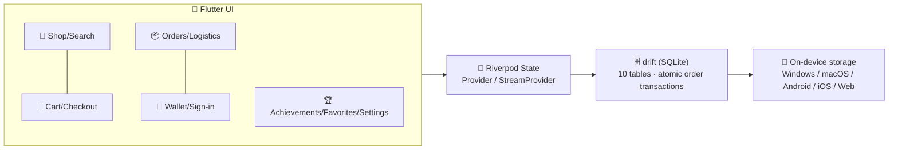

<p align="center">
  <a href="README.md">简体中文</a> ·
  <a href="README.zh-Hant.md">繁體中文</a> ·
  <a href="#-impulsive-consumption">English</a>
</p>

<p align="center">
  
</p>

<p align="center">
  <a href="https://flutter.dev"></a>
  <a href="https://dart.dev"></a>
  <a href="https://drift.simonbinder.eu/"></a>
  <a href="https://riverpod.dev/"></a>
  
  
  
</p>

# 🛍️ Impulsive Consumption

> 💥 **Buy today, regret tomorrow!** —— a light-gamified shopping simulator that is **100% local, zero network, zero real payment**.

Experience the full shopping spree — browse → cart → coupons → checkout → orders → logistics → sign-in → achievements — with all data stored only on your device (SQLite). Splurge freely, reset with one tap, start over anytime.

## ✨ Highlights

| 🎮 Module | 🎯 What you get |
|---|---|
| 🏪 **Product system** | 28 hand-drawn illustrated products · 6 categories · search · detail page · simulated monthly sales / rating / stock · **daily auto restock** |
| 👛 **Local wallet** | Initial balance ¥10,000 · simulated top-up · balance check & deduction · full transaction history |
| 🛒 **Cart** | Partial checkout with checkboxes · real-time total · quantity capped by stock · clear all |
| 💳 **Checkout & payment** | 4 coupons (fixed-off / percent-off) · insufficient-balance flow to recharge · **~30% chance of a lucky egg** (surprise discount / rebate) · confetti + check-mark animation · atomic order transaction |
| 📦 **Order center** | Order history · details · **simulated logistics timeline** (updates every second) · one-tap buy again |
| 🚚 **Two logistics speeds** | Turbo demo (~3 min delivery, default) / Realistic (1–3 days); progress survives restarts |
| ✍️ **Daily sign-in** | 7-day cycle with increasing rewards (¥5~¥12), streak resets on a missed day |
| 🏆 **Achievements** | First Order / Shopaholic / Week Streak / Collector / Big Spender + badge wall |
| ❤️ **Favorites** | Wishlist-style collection |
| 🌏 **3 languages & currencies** | Simplified Chinese / Traditional Chinese / English; CNY ¥ / HKD HK$ / USD US$ with live conversion |
| 🌗 **Themes** | Creamy warm base + vivid orange-coral, light / dark / system |
| 🔄 **Demo reset** | One tap in Settings to restore the initial state |
| 📴 **Fully offline** | Zero network requests; all product art is bundled |

## 📸 Screenshots

<p align="center">
  
  
</p>

## 🖼️ Product Gallery (28 hand-drawn items)

### 📱 Digital
| <br><sub>Starlight X1 Phone · ¥7999</sub> | <br><sub>Silence Pro ANC Buds · ¥1299</sub> | <br><sub>Flow S Smart Watch · ¥1899</sub> | <br><sub>Swift Air Ultrabook · ¥6599</sub> | <br><sub>Frame M2 Mirrorless · ¥4599</sub> | <br><sub>Nova Tablet · ¥2499</sub> | <br><sub>Summer Glare Shades · ¥199</sub> |
|---|---|---|---|---|---|---|

### 👕 Fashion
| <br><sub>Cloud Runner Sneakers · ¥599</sub> | <br><sub>Cotton Print Tee · ¥129</sub> | <br><sub>Warm Wool Coat · ¥899</sub> | <br><sub>Street Baseball Cap · ¥89</sub> | <br><sub>Retro Straight Jeans · ¥299</sub> |
|---|---|---|---|---|

### 🍰 Food
| <br><sub>Velvet Chocolate Box · ¥99</sub> | <br><sub>Pour-over Coffee Beans · ¥128</sub> | <br><sub>Sunshine Fruit Basket · ¥168</sub> | <br><sub>Midnight Ramen Kit · ¥59</sub> | <br><sub>Alpine Oolong Tea · ¥218</sub> |
|---|---|---|---|---|

### 🛋️ Home
| <br><sub>Cloud Modular Sofa · ¥2999</sub> | <br><sub>Care Smart Lamp · ¥199</sub> | <br><sub>Healing Bear Plush · ¥79</sub> | <br><sub>Forest Aroma Candle · ¥69</sub> | <br><sub>Handmade Ceramic Mug · ¥49</sub> |
|---|---|---|---|---|

### 💄 Beauty
| <br><sub>Velvet Matte Lipstick · ¥320</sub> | <br><sub>Glow Moisturizer Cream · ¥480</sub> | <br><sub>Nail Party Polish Set · ¥150</sub> |
|---|---|---|

### 📚 Books
| <br><sub>Stardust Trilogy · ¥89</sub> | <br><sub>Watercolor Starter Guide · ¥129</sub> | <br><sub>City Wander Guide · ¥59</sub> |
|---|---|---|

## 🏗️ Architecture



## 🚀 Quick Start

| Platform | Command | Output |
|---|---|---|
| 📱 Android | `flutter build apk --release` | `build/app/outputs/flutter-apk/app-release.apk` |
| 🌐 Web (recommended for Windows testing) | `flutter build web --release --base-href /` then double-click `start_web.bat` | Serve locally in your browser — no domain needed |
| 🪟 Windows native | `flutter build windows --release` | Requires Windows + Visual Studio toolchain |
| 🍎 macOS / iOS | `flutter build macos --release` / `flutter build ios --release` | Requires macOS + Xcode |
| 🔧 Dev | `flutter run -d chrome` | Hot reload |

```bash
flutter analyze   # 0 issues
flutter test      # 18 unit tests green (currency/coupons/logistics/catalog)
```

## 🎨 Make It Yours

- **Real product photos**: overwrite `assets/images/products/<product-id>.png` with same-name files (square, 600×600+ recommended)
- **Regenerate illustrations**: edit `tool/assets_src/*.svg` → `bash tool/gen_images.sh` (requires Chrome)
- **App icon**: edit `tool/assets_src/app_icon.svg` → regenerate → `dart run flutter_launcher_icons`

| Simulated parameter | Where |
|---|---|
| Exchange rates (CNY=1 / HKD=0.92 / USD=7.20) | `lib/core/money.dart` |
| Initial balance ¥10,000 | `lib/data/catalog/products.dart` → `initialBalanceCents` |
| Products / prices / stock / sales / rating | same file, `products` |
| Coupons / sign-in rewards | same file, `couponPresets` / `signinRewards` |
| Logistics durations | `lib/core/logistics.dart` |
| Lucky-egg probability & amount | `lib/data/db/database.dart` → `placeOrder` |
| Achievement thresholds | `lib/core/achievements.dart` |

## ❓ FAQ

- **Web version shows a blank page?** Flutter Web must be served over http (opening `file://` won't work) — use `start_web.bat` or any static server.
- **APK install warning?** An unsigned test build triggers a normal warning; configure signing before publishing to stores.
- **How to plug in a real backend?** All data access lives in `lib/data/db/database.dart` and `lib/state/providers.dart` — swap them for API calls; the UI stays untouched.
- **Demo state messed up?** Me → Settings → Reset demo data, back to a fresh ¥10,000 start.

## 📜 License

[MIT](LICENSE) © 2026 Impulsive Consumption contributors

---

<p align="center">🛍️ This app is a pure simulation: no real payments, no network requests 🛍️</p>
