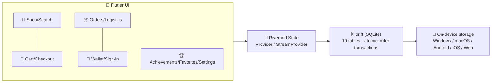

<p align="center">
  <a href="README.md">简体中文</a> ·
  <a href="README.zh-Hant.md">繁體中文</a> ·
  <a href="#-impulsive-consumption">English</a>
</p>

<p align="center">
  
</p>

<p align="center">
  <a href="https://flutter.dev"></a>
  <a href="https://dart.dev"></a>
  <a href="https://drift.simonbinder.eu/"></a>
  <a href="https://riverpod.dev/"></a>
  
  
  
</p>

# 🛍️ Impulsive Consumption

> 💥 **Buy today, regret tomorrow!** —— a light-gamified shopping simulator that is **100% local, zero network, zero real payment**.

Experience the full shopping spree — browse → cart → coupons → checkout → orders → logistics → sign-in → achievements — with all data stored only on your device (SQLite). Splurge freely, reset with one tap, start over anytime.

## ✨ Highlights

| 🎮 Module | 🎯 What you get |
|---|---|
| 🏪 **Product system** | 28 real products · 6 categories · search · detail page · simulated monthly sales / rating / stock · **daily auto restock** |
| 👛 **Local wallet** | Initial balance ¥10,000 · simulated top-up · balance check & deduction · full transaction history |
| 🛒 **Cart** | Partial checkout with checkboxes · real-time total · quantity capped by stock · clear all |
| 💳 **Checkout & payment** | 4 coupons (fixed-off / percent-off) · insufficient-balance flow to recharge · **~30% chance of a lucky egg** (surprise discount / rebate) · confetti + check-mark animation · atomic order transaction |
| 📦 **Order center** | Order history · details · **simulated logistics timeline** (updates every second) · one-tap buy again |
| 🚚 **Two logistics speeds** | Turbo demo (~3 min delivery, default) / Realistic (1–3 days); progress survives restarts |
| ✍️ **Daily sign-in** | 7-day cycle with increasing rewards (¥5~¥12), streak resets on a missed day |
| 🏆 **Achievements** | First Order / Shopaholic / Week Streak / Collector / Big Spender + badge wall |
| ❤️ **Favorites** | Wishlist-style collection |
| 🌏 **3 languages & currencies** | Simplified Chinese / Traditional Chinese / English; CNY ¥ / HKD HK$ / USD US$ with live conversion |
| 🌗 **Themes** | Creamy warm base + vivid orange-coral, light / dark / system |
| 🔄 **Demo reset** | One tap in Settings to restore the initial state |
| 📴 **Fully offline** | Zero network requests; all product art is bundled |

## 📸 Screenshots

<p align="center">
  
  
</p>

## 🖼️ Product Gallery (28 real items)

### 🖥️ Graphics Cards
| <br><sub>NVIDIA GeForce RTX 4090 24GB · ¥12,999</sub> | <br><sub>Gigabyte GeForce RTX 5090 Windforce OC 32GB · ¥16,499</sub> | <br><sub>ASUS ROG Strix GeForce RTX 4090 24GB · ¥13,499</sub> | <br><sub>Zotac GeForce RTX 5090 Solid OC 32GB · ¥15,999</sub> | <br><sub>MSI GeForce RTX 4090 Gaming Trio 24GB · ¥12,899</sub> | <br><sub>Gigabyte RTX 5090 Aorus Master 32GB · ¥17,999</sub> | <br><sub>Inno3D GeForce RTX 5090 X3 32GB · ¥14,899</sub> |
|---|---|---|---|---|---|---|

### 🎮 Gaming Gear
| <br><sub>PlayStation 5 Slim Digital Edition · ¥2,999</sub> | <br><sub>Stern Metallica Pro Pinball Machine · ¥49,999</sub> | <br><sub>Air Kids Air Hockey Table · ¥8,999</sub> | <br><sub>Pro Coin-Operated Air Hockey Table · ¥13,999</sub> | <br><sub>Fanatec Gran Turismo DD Extreme Kit · ¥11,999</sub> | <br><sub>Fanatec ClubSport Racing Wheel F1 Kit · ¥10,999</sub> | <br><sub>Simagic Alpha Pro Wheelbase Combo · ¥9,899</sub> | <br><sub>Darth Vader Mythos 1/4 Statue · ¥10,499</sub> | <br><sub>Fanatec ClubSport DD+ Base Kit · ¥9,499</sub> |
|---|---|---|---|---|---|---|---|---|

### 💻 Gaming PCs
| <br><sub>Pulse BluePC Gaming PC (i9-14900KF) · ¥13,999</sub> | <br><sub>AURA by BluePC Workstation · ¥17,499</sub> |
|---|---|

### 💄 Beauty & Skincare
| <br><sub>Centella Soothing Cream 50ml · ¥159</sub> | <br><sub>Round Lab 1025 Dokdo Toner 190ml · ¥169</sub> | <br><sub>Some By Mi 30-Day Miracle Acne Foam · ¥149</sub> | <br><sub>Korean Sheet Mask Set (6 pcs) · ¥89</sub> | <br><sub>Collagen Sheet Mask (6 pcs) · ¥79</sub> | <br><sub>Beauty of Joseon Sunscreen · ¥129</sub> | <br><sub>Overnight Lip Mask 20g · ¥99</sub> | <br><sub>Medicube PDRN Pink Mask 28g · ¥139</sub> | <br><sub>Laneige Lip Sleeping Mask (Berry) 20g · ¥169</sub> | <br><sub>Dokdo 1025 Exfoliating Toner 100ml · ¥179</sub> |
|---|---|---|---|---|---|---|---|---|---|

## 🏗️ Architecture



## 📥 Download & Install (no dev environment needed)

- 📱 **Android**: grab the latest `app-release.apk` from the [Releases page](https://github.com/Toby-TB/impulsive-consumption/releases), copy it to your phone and install (allow "unknown sources")
- 🌐 **Web/PC**: just open https://toby-tb.github.io/impulsive-consumption/ (no install needed)

## 🚀 Quick Start (developers)

| Platform | Command | Output |
|---|---|---|
| 📱 Android | `flutter build apk --release` | `build/app/outputs/flutter-apk/app-release.apk` |
| 🌐 Web (recommended for Windows testing) | `flutter build web --release --base-href /` then double-click `start_web.bat` | Serve locally in your browser — no domain needed |
| 🪟 Windows native | `flutter build windows --release` | Requires Windows + Visual Studio toolchain |
| 🍎 macOS / iOS | `flutter build macos --release` / `flutter build ios --release` | Requires macOS + Xcode |
| 🔧 Dev | `flutter run -d chrome` | Hot reload |

> 🌍 **Live demo (GitHub Pages)**: https://toby-tb.github.io/impulsive-consumption/ —— auto-built & deployed on every push to main

```bash
flutter analyze   # 0 issues
flutter test      # 18 unit tests green (currency/coupons/logistics/catalog)
```

## 🎨 Make It Yours

- **Your own product photos**: overwrite `assets/images/products/<product-id>.png` with same-name files (square, 600×600+ recommended)
- **Re-fetch real product images**: edit `tool/fetch_real.sh` and run it (images come from public product pages, for learning/demo only — do not use commercially)
- **Regenerate banner & app icon**: `bash tool/gen_images.sh` (requires Chrome), then `dart run flutter_launcher_icons`

| Simulated parameter | Where |
|---|---|
| Exchange rates (CNY=1 / HKD=0.92 / USD=7.20) | `lib/core/money.dart` |
| Initial balance ¥10,000 | `lib/data/catalog/products.dart` → `initialBalanceCents` |
| Products / prices / stock / sales / rating | same file, `products` |
| Coupons / sign-in rewards | same file, `couponPresets` / `signinRewards` |
| Logistics durations | `lib/core/logistics.dart` |
| Lucky-egg probability & amount | `lib/data/db/database.dart` → `placeOrder` |
| Achievement thresholds | `lib/core/achievements.dart` |

## ❓ FAQ

- **Image credits**: product images come from public product pages such as dopamineshopping.com, for learning/demo purposes only — replace them with your own images for commercial use.
- **Web version shows a blank page?** Flutter Web must be served over http (opening `file://` won't work) — use `start_web.bat` or any static server.
- **APK install warning?** An unsigned test build triggers a normal warning; configure signing before publishing to stores.
- **How to plug in a real backend?** All data access lives in `lib/data/db/database.dart` and `lib/state/providers.dart` — swap them for API calls; the UI stays untouched.
- **Demo state messed up?** Me → Settings → Reset demo data, back to a fresh ¥10,000 start.

## 📜 License

[MIT](LICENSE) © 2026 Impulsive Consumption contributors

---

<p align="center">🛍️ This app is a pure simulation: no real payments, no network requests 🛍️</p>
