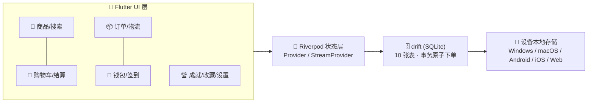

<p align="center">
  <a href="#-冲动消费--impulsive-consumption">简体中文</a> ·
  <a href="README.zh-Hant.md">繁體中文</a> ·
  <a href="README.en.md">English</a>
</p>

<p align="center">
  
</p>

<p align="center">
  <a href="https://flutter.dev"></a>
  <a href="https://dart.dev"></a>
  <a href="https://drift.simonbinder.eu/"></a>
  <a href="https://riverpod.dev/"></a>
  
  
  
</p>

# 🛍️ 冲动消费 · Impulsive Consumption

> 💥 **今天不买，明天后悔！** —— 一个 **纯本地 · 零网络 · 零真实支付** 的轻游戏化模拟购物 App。

完整体验「逛 → 加购 → 领券 → 支付 → 订单 → 物流 → 签到 → 成就」的购物狂欢，所有数据只存在你的设备里（SQLite），随便挥霍、一键重置、放心重来。

## ✨ 玩点一览

| 🎮 模块 | 🎯 亮点 |
|---|---|
| 🏪 **商品系统** | 28 件手绘插画商品 · 6 大分类 · 搜索 · 详情页 · 月销量/评分/库存拟真字段 · **次日自动补货** |
| 👛 **本地钱包** | 初始余额 ¥10,000 · 模拟充值 · 支付校验扣款 · 收支明细全记录 |
| 🛒 **购物车** | 勾选部分结算 · 实时总价 · 数量上限=库存 · 一键清空 |
| 💳 **结算支付** | 4 张优惠券（满减/折扣）· 余额不足引导充值 · **约 30% 概率触发支付彩蛋**（惊喜立减/返币）· 彩带+打勾支付动画 · 事务原子下单 |
| 📦 **订单中心** | 历史订单 · 详情 · **模拟物流时间线**（每秒推进）· 一键再次购买 |
| 🚚 **双档物流** | 极速演示约 3 分钟送达（默认）/ 拟真 1–3 天，重启后进度不丢 |
| ✍️ **每日签到** | 连续 7 天循环递增奖励（¥5~¥12），断签重来 |
| 🏆 **成就徽章** | 首单达成 / 剁手大师 / 七日之约 / 收藏家 / 挥金如土 + 徽章墙 |
| ❤️ **收藏夹** | 心愿单式收藏，一键直达 |
| 🌏 **三语三币** | 简体中文 / 繁體中文 / English；CNY ¥ / HKD HK$ / USD US$ 即时换算 |
| 🌗 **主题** | 奶油暖底 + 活力橙珊瑚，明/暗/跟随系统 |
| 🔄 **演示重置** | 设置页一键恢复初始状态，随时重新开玩 |
| 📴 **完全离线** | 无任何网络请求，商品图随应用打包 |

## 📸 界面预览

<p align="center">
  
  
</p>

## 🖼️ 商品画廊（28 件手绘插画）

### 📱 数码
| <br><sub>星辉 X1 智能手机 · ¥7999</sub> | <br><sub>静界 Pro 降噪耳机 · ¥1299</sub> | <br><sub>流光 S 智能手表 · ¥1899</sub> | <br><sub>极速 Air 轻薄本 · ¥6599</sub> | <br><sub>定格 M2 微单相机 · ¥4599</sub> | <br><sub>幻彩 Nova 平板 · ¥2499</sub> | <br><sub>夏日炫光墨镜 · ¥199</sub> |
|---|---|---|---|---|---|---|

### 👕 服饰
| <br><sub>云感缓震跑鞋 · ¥599</sub> | <br><sub>纯棉印花 T 恤 · ¥129</sub> | <br><sub>暖冬羊毛大衣 · ¥899</sub> | <br><sub>街头棒球帽 · ¥89</sub> | <br><sub>复古直筒牛仔裤 · ¥299</sub> |
|---|---|---|---|---|

### 🍰 食品
| <br><sub>丝绒巧克力礼盒 · ¥99</sub> | <br><sub>手冲精品咖啡豆 · ¥128</sub> | <br><sub>阳光鲜果礼篮 · ¥168</sub> | <br><sub>深夜拉面套餐 · ¥59</sub> | <br><sub>高山乌龙茶 · ¥218</sub> |
|---|---|---|---|---|

### 🛋️ 家居
| <br><sub>云朵模块沙发 · ¥2999</sub> | <br><sub>护眼智能台灯 · ¥199</sub> | <br><sub>治愈系小熊抱枕 · ¥79</sub> | <br><sub>森林香薰蜡烛 · ¥69</sub> | <br><sub>手作陶瓷马克杯 · ¥49</sub> |
|---|---|---|---|---|

### 💄 美妆
| <br><sub>丝绒哑光口红 · ¥320</sub> | <br><sub>焕颜保湿面霜 · ¥480</sub> | <br><sub>指尖派对指甲油套装 · ¥150</sub> |
|---|---|---|

### 📚 图书
| <br><sub>星尘往事三部曲 · ¥89</sub> | <br><sub>零基础水彩教程 · ¥129</sub> | <br><sub>城市漫游指南 · ¥59</sub> |
|---|---|---|

## 🏗️ 架构



## 🚀 快速开始

| 平台 | 命令 | 产物 |
|---|---|---|
| 📱 Android | `flutter build apk --release` | `build/app/outputs/flutter-apk/app-release.apk` |
| 🌐 Web（Windows 测试推荐） | `flutter build web --release --base-href /` 后双击 `start_web.bat` | 浏览器本地打开，无需域名 |
| 🪟 Windows 原生 | `flutter build windows --release` | 需 Windows + Visual Studio 工具链 |
| 🍎 macOS / iOS | `flutter build macos --release` / `flutter build ios --release` | 需 macOS + Xcode |
| 🔧 开发调试 | `flutter run -d chrome` | 热重载 |

```bash
flutter analyze   # 0 issue
flutter test      # 18 个单测全绿（汇率/优惠券/物流/目录一致性）
```

## 🎨 自由定制

- **换成真实商品图**：同名覆盖 `assets/images/products/<商品id>.png` 即可（600×600+ 方形为佳）
- **重新生成插画**：编辑 `tool/assets_src/*.svg` → `bash tool/gen_images.sh`（需 Chrome）
- **改应用图标**：编辑 `tool/assets_src/app_icon.svg` → 生成后 `dart run flutter_launcher_icons`

| 模拟参数 | 位置 |
|---|---|
| 汇率（CNY=1 / HKD=0.92 / USD=7.20） | `lib/core/money.dart` |
| 初始余额 ¥10,000 | `lib/data/catalog/products.dart` → `initialBalanceCents` |
| 商品/价格/库存/月销/评分 | 同文件 `products` |
| 优惠券 / 签到奖励 | 同文件 `couponPresets` / `signinRewards` |
| 物流时长两档 | `lib/core/logistics.dart` |
| 支付彩蛋概率与力度 | `lib/data/db/database.dart` → `placeOrder` |
| 成就门槛 | `lib/core/achievements.dart` |

## ❓ 常见问题

- **Web 版白屏？** Flutter Web 必须通过 http 服务访问（`file://` 打开不行），用 `start_web.bat` 或任意静态服务器。
- **APK 安装提示风险？** 未签名的测试包属正常提示；上架商店需自行配置签名。
- **怎么接真实后端？** 数据层集中在 `lib/data/db/database.dart` 与 `lib/state/providers.dart`，替换为 API 调用即可，UI 无需改动。
- **演示乱了怎么办？** 我的 → 设置 → 重置演示数据，一键回到 ¥10,000 开局。

## 📜 License

[MIT](LICENSE) © 2026 冲动消费 contributors

---

<p align="center">🛍️ 本应用为纯模拟演示：不涉及真实支付，也不会发起任何网络请求 🛍️</p>
