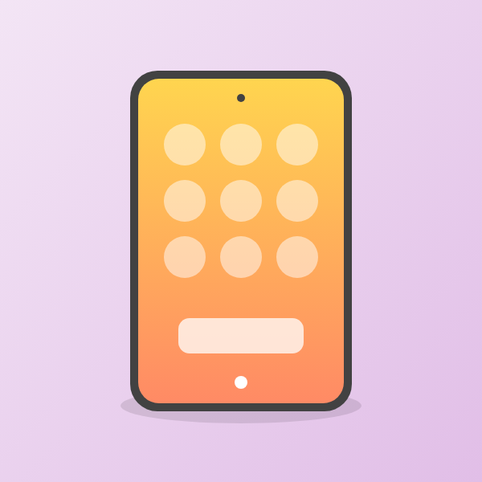
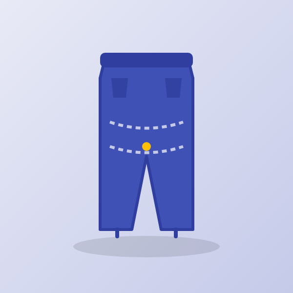
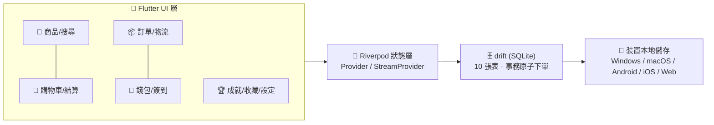

<p align="center">
  <a href="README.md">简体中文</a> ·
  <a href="#-衝動消費--impulsive-consumption">繁體中文</a> ·
  <a href="README.en.md">English</a>
</p>

<p align="center">
  
</p>

<p align="center">
  <a href="https://flutter.dev"></a>
  <a href="https://dart.dev"></a>
  <a href="https://drift.simonbinder.eu/"></a>
  <a href="https://riverpod.dev/"></a>
  
  
  
</p>

# 🛍️ 衝動消費 · Impulsive Consumption

> 💥 **今天不買，明天後悔！** —— 一個 **純本地 · 零網路 · 零真實支付** 的輕遊戲化模擬購物 App。

完整體驗「逛 → 加購 → 領券 → 支付 → 訂單 → 物流 → 簽到 → 成就」的購物狂歡，所有資料只存在你的裝置裡（SQLite），隨便揮霍、一鍵重置、放心重來。

## ✨ 玩點一覽

| 🎮 模組 | 🎯 亮點 |
|---|---|
| 🏪 **商品系統** | 28 件手繪插畫商品 · 6 大分類 · 搜尋 · 詳情頁 · 月銷量/評分/庫存擬真欄位 · **次日自動補貨** |
| 👛 **本地錢包** | 初始餘額 ¥10,000 · 模擬充值 · 支付校驗扣款 · 收支明細全記錄 |
| 🛒 **購物車** | 勾選部分結算 · 即時總價 · 數量上限=庫存 · 一鍵清空 |
| 💳 **結算支付** | 4 張優惠券（滿減/折扣）· 餘額不足引導充值 · **約 30% 機率觸發支付彩蛋**（驚喜立減/返幣）· 彩帶+打勾支付動畫 · 事務原子下單 |
| 📦 **訂單中心** | 歷史訂單 · 詳情 · **模擬物流時間線**（每秒推進）· 一鍵再次購買 |
| 🚚 **雙檔物流** | 極速演示約 3 分鐘送達（預設）/ 擬真 1–3 天，重啟後進度不丟 |
| ✍️ **每日簽到** | 連續 7 天循環遞增獎勵（¥5~¥12），斷簽重來 |
| 🏆 **成就徽章** | 首單達成 / 剁手大師 / 七日之約 / 收藏家 / 揮金如土 + 徽章牆 |
| ❤️ **收藏夾** | 心願單式收藏，一鍵直達 |
| 🌏 **三語三幣** | 简体中文 / 繁體中文 / English；CNY ¥ / HKD HK$ / USD US$ 即時換算 |
| 🌗 **主題** | 奶油暖底 + 活力橙珊瑚，明/暗/跟隨系統 |
| 🔄 **演示重置** | 設定頁一鍵恢復初始狀態，隨時重新開玩 |
| 📴 **完全離線** | 無任何網路請求，商品圖隨應用打包 |

## 📸 介面預覽

<p align="center">
  
  
</p>

## 🖼️ 商品畫廊（28 件手繪插畫）

### 📱 數碼
| <br><sub>星輝 X1 智能手機 · ¥7999</sub> | <br><sub>靜界 Pro 降噪耳機 · ¥1299</sub> | <br><sub>流光 S 智能手錶 · ¥1899</sub> | <br><sub>極速 Air 輕薄本 · ¥6599</sub> | <br><sub>定格 M2 微單相機 · ¥4599</sub> | <br><sub>幻彩 Nova 平板 · ¥2499</sub> | <br><sub>夏日炫光墨鏡 · ¥199</sub> |
|---|---|---|---|---|---|---|

### 👕 服飾
| <br><sub>雲感緩震跑鞋 · ¥599</sub> | <br><sub>純棉印花 T 恤 · ¥129</sub> | <br><sub>暖冬羊毛大衣 · ¥899</sub> | <br><sub>街頭棒球帽 · ¥89</sub> | <br><sub>復古直筒牛仔褲 · ¥299</sub> |
|---|---|---|---|---|

### 🍰 食品
| <br><sub>絲絨巧克力禮盒 · ¥99</sub> | <br><sub>手沖精品咖啡豆 · ¥128</sub> | <br><sub>陽光鮮果禮籃 · ¥168</sub> | <br><sub>深夜拉麵套餐 · ¥59</sub> | <br><sub>高山烏龍茶 · ¥218</sub> |
|---|---|---|---|---|

### 🛋️ 家居
| <br><sub>雲朵模組沙發 · ¥2999</sub> | <br><sub>護眼智能檯燈 · ¥199</sub> | <br><sub>治癒系小熊抱枕 · ¥79</sub> | <br><sub>森林香薰蠟燭 · ¥69</sub> | <br><sub>手作陶瓷馬克杯 · ¥49</sub> |
|---|---|---|---|---|

### 💄 美妝
| <br><sub>絲絨啞光口紅 · ¥320</sub> | <br><sub>煥顏保濕面霜 · ¥480</sub> | <br><sub>指尖派對指甲油套裝 · ¥150</sub> |
|---|---|---|

### 📚 圖書
| <br><sub>星塵往事三部曲 · ¥89</sub> | <br><sub>零基礎水彩教程 · ¥129</sub> | <br><sub>城市漫遊指南 · ¥59</sub> |
|---|---|---|

## 🏗️ 架構



## 🚀 快速開始

| 平台 | 命令 | 產物 |
|---|---|---|
| 📱 Android | `flutter build apk --release` | `build/app/outputs/flutter-apk/app-release.apk` |
| 🌐 Web（Windows 測試推薦） | `flutter build web --release --base-href /` 後雙擊 `start_web.bat` | 瀏覽器本地開啟，無需域名 |
| 🪟 Windows 原生 | `flutter build windows --release` | 需 Windows + Visual Studio 工具鏈 |
| 🍎 macOS / iOS | `flutter build macos --release` / `flutter build ios --release` | 需 macOS + Xcode |
| 🔧 開發調試 | `flutter run -d chrome` | 熱重載 |

```bash
flutter analyze   # 0 issue
flutter test      # 18 個單測全綠（匯率/優惠券/物流/目錄一致性）
```

## 🎨 自由訂製

- **換成真實商品圖**：同名覆蓋 `assets/images/products/<商品id>.png` 即可（600×600+ 方形為佳）
- **重新生成插畫**：編輯 `tool/assets_src/*.svg` → `bash tool/gen_images.sh`（需 Chrome）
- **改應用圖示**：編輯 `tool/assets_src/app_icon.svg` → 生成後 `dart run flutter_launcher_icons`

| 模擬參數 | 位置 |
|---|---|
| 匯率（CNY=1 / HKD=0.92 / USD=7.20） | `lib/core/money.dart` |
| 初始餘額 ¥10,000 | `lib/data/catalog/products.dart` → `initialBalanceCents` |
| 商品/價格/庫存/月銷/評分 | 同檔案 `products` |
| 優惠券 / 簽到獎勵 | 同檔案 `couponPresets` / `signinRewards` |
| 物流時長兩檔 | `lib/core/logistics.dart` |
| 支付彩蛋機率與力度 | `lib/data/db/database.dart` → `placeOrder` |
| 成就門檻 | `lib/core/achievements.dart` |

## ❓ 常見問題

- **Web 版白屏？** Flutter Web 必須透過 http 服務訪問（`file://` 開啟不行），用 `start_web.bat` 或任意靜態伺服器。
- **APK 安裝提示風險？** 未簽名的測試包屬正常提示；上架商店需自行設定簽名。
- **怎麼接真實後端？** 資料層集中在 `lib/data/db/database.dart` 與 `lib/state/providers.dart`，替換為 API 呼叫即可，UI 無需改動。
- **演示亂了怎麼辦？** 我的 → 設定 → 重置演示資料，一鍵回到 ¥10,000 開局。

## 📜 License

[MIT](LICENSE) © 2026 衝動消費 contributors

---

<p align="center">🛍️ 本應用為純模擬演示：不涉及真實支付，也不會發起任何網路請求 🛍️</p>
